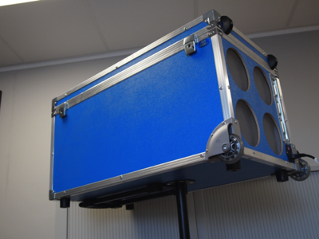
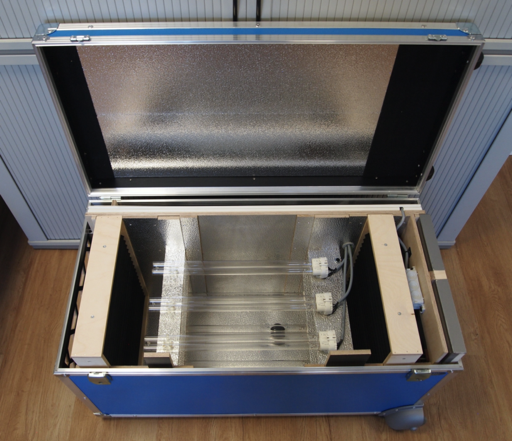
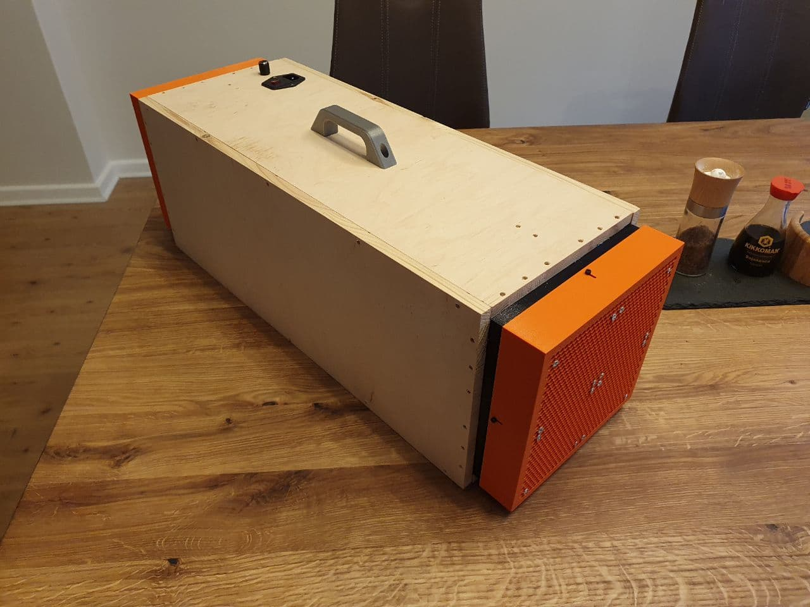
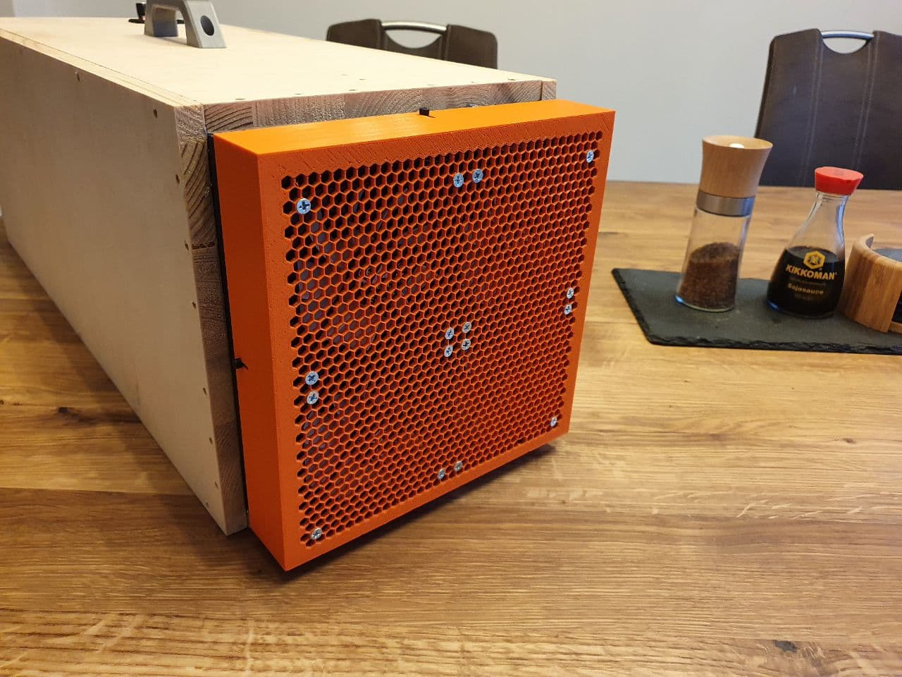
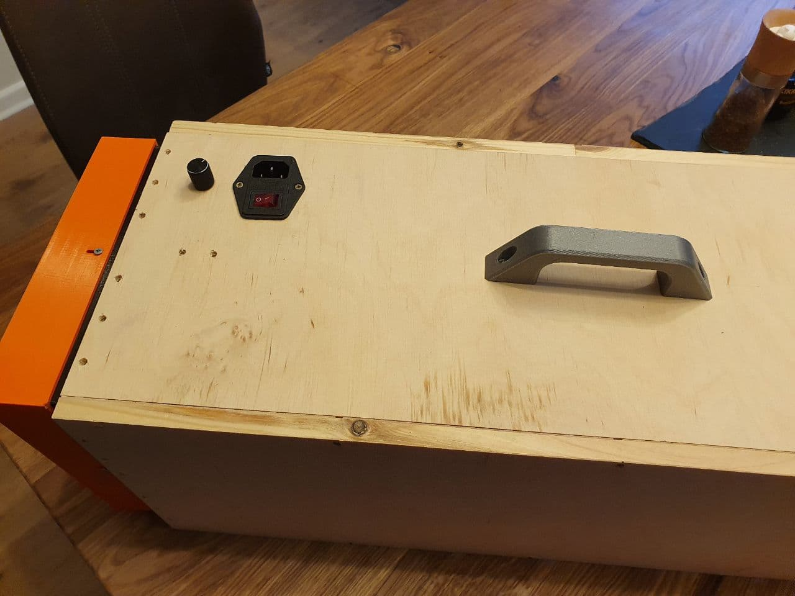

# Clean Air Device - an open UV-C aircleaner unit

## What is this?

This repository contains the building plans to build a DIY-air-cleaner based on UV-C radiation - the "cleanair" device.
The large device consists of 6 36W UV-C lamps in a flight case with extra space for electronics and the ESP32 control unit. The small one is able to handle up to 4 55W UV-C lamps and can be printed using a 3d printer capable of printing 22cm x 22cm blocks.

### Anycase Version

 

### 3D printable Version

## Why would I need this (what is the purpose)?

It seems reliable, that ultraviolet light (especially the UV-C variant) can help kill viruses.
On the other hand, UVC is dangerous to eyes and skin.

At MaibornWolff we put our engineering minds to it and created a solution which works for us.

**We build a mobile, safe container with UVC lights inside.**

Here are some reading information sources, if you want to read up on various opinions:

- https://www.medrxiv.org/content/10.1101/2020.05.31.20118588v3
- https://www.bbc.com/future/article/20200327-can-you-kill-coronavirus-with-uv-light
- https://www.cuimc.columbia.edu/news/far-uvc-light-safely-kills-airborne-coronaviruses
- https://pubmed.ncbi.nlm.nih.gov/32547908/

We estimated the irradiance inside the device as described in the [calculation (PDF)](documentation/theory.pdf).

## Getting started

In order to get started you have to decide if you want to build the large device or the small one. The large is device is mostly build by hand where the smaller one can be 3D-printed.

More information can be found in the [documentation section](documentation/README.md).

## Warning!

This device uses UV-C lamps which will damage skin and eyes. BE CAREFUL AND DO NOT TURN THE LAMPS ON OUTSIDE THE CASING!
Furthermore be aware of working with High Voltage for the lamps. CAUTION HIGH VOLTAGE!

## FAQ

### Why is it free?

We at MaibornWolff believe we have a responsibility to society, especially in these difficult times. As an IT company we had a good business year, regardless of Corona, and now it is time to use our knowledge in creating IT solutions to build an affordable and free air cleaner everyone can use.
We will not build our own "MaibornWolff Air Cleaner" unit and sell it. We have no whatsoever financial interest. Instead, we encourage you to help us make the device better, more easy to use, more cheap to produce, so everyone - companies, schools, kindergardens - could probably have one.

### What license are you using?

The code and documentation is licensed under the [MIT](LICENSE) license. The hardware documentation, build plans and 3d files are licensed under the [Creative Commons Attribution 3.0 Unported](cc-by-sa-3.0-unported.txt) license.

### How can I help?

Have a look at the [CONTRIBUTING](CONTRIBUTING.md) documentation. You can also join our [Slack Channel](https://maibornwolffcleanair.slack.com/) to get in touch with us.
