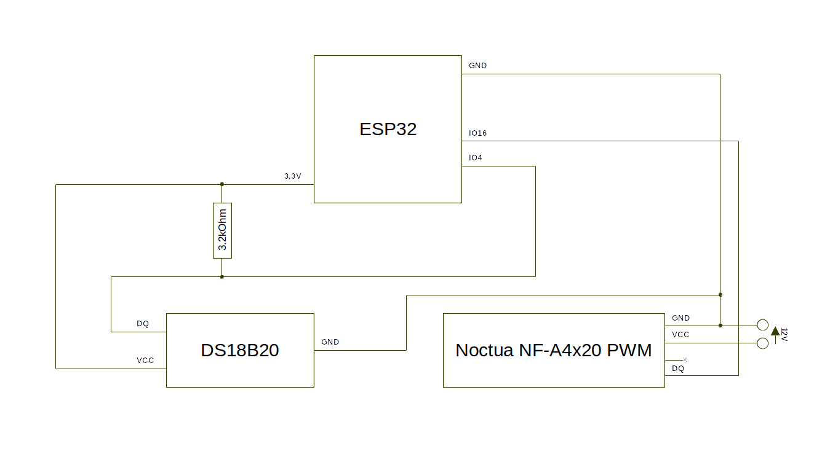

# Case Temperature Controller

Sub-program for regulating a PWM controlled fan to keep a steady temperature within the case.

Written for ESP32, Xinda Temperature Sensor, Noctua NF-A4x20 in C.

This program is basically implementing a PID controller. To understand the underlying calculation, check the following wikipedia article: https://en.wikipedia.org/wiki/PID_controller#Alternative_nomenclature_and_forms

# Circuit Diagram

